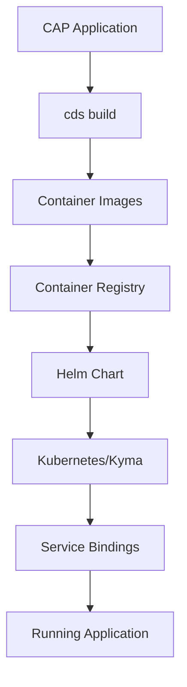

# Approuter Demo with IAS Integration

A CAP (Cloud Application Programming) project demonstrating Approuter integration with SAP Identity Authentication Service (IAS) on Kubernetes.

## Project Structure

File or Folder | Purpose
---------|----------
`app/` | UI frontends and Approuter configuration
`app/router/` | Approuter specific files and Dockerfile
`srv/` | Service models and business logic
`chart/` | Helm chart configuration for Kubernetes deployment
`chart/files/` | Static files (xs-app.json, index.html, favicon.svg) used by Helm templates
`containerize.yaml` | Containerization configuration with multi-platform support
`package.json` | Project metadata and configuration
`Dockerfile` | Service container configuration

## Chart Files Approach

The project uses a dual-source approach for approuter configuration:

1. **`app/router/`** - Original approuter files for local development
2. **`chart/files/`** - Copies of static files used by Helm templates during deployment

The `cds build --production` command automatically:
- Copies `chart/files/` to `gen/chart/files/`
- Generates ConfigMap templates that reference these files
- Ensures deployment uses the same configuration as local development

This approach eliminates duplication and ensures consistency between local and deployed environments.

## Features

- **CAP Service**: Node.js service with IAS authentication
- **Approuter**: SAP Approuter with IAS integration
- **Multi-platform Docker**: Supports both ARM64 and AMD64 architectures
- **Kubernetes Ready**: Complete Helm chart for deployment
- **Service Bindings**: Automated IAS and destination service bindings

## Prerequisites

- Node.js 22+ (project uses Node.js 22 in containers)
- Docker with buildx support
- Kubernetes cluster with SAP BTP services
- SAP BTP services configured:
  - Identity Authentication Service (IAS)
  - Destination service
  - XSUAA service

## Local Development

### Setup

1. **Install dependencies:**
   ```bash
   npm install
   ```

### Running Locally

2. **Start local development server:**
   ```bash
   npm run serve
   # or
   cds serve
   ```

3. **Bind services for local development:**
   ```bash
   # Bind IAS service for authentication
   cds bind ias-router-test-identity
   
   # Bind destination service
   cds bind ias-router-test-destination
   ```

4. **Run with hybrid profile (local services with remote bindings):**
   ```bash
   cds serve --profile hybrid
   ```

## CDS CLI Commands

### Development Commands

| Command | Purpose | Example |
|---------|---------|---------|
| `cds serve` | Start local development server | `cds serve` |
| `cds watch` | Start with auto-reload on file changes | `cds watch` |
| `cds serve --profile hybrid` | Run with hybrid profile (local + remote bindings) | `cds serve --profile hybrid` |
| `cds debug` | Start local debug mode with Chrome DevTools | `cds debug` |
| `cds bind <service>` | Bind remote service for local development | `cds bind ias-router-test-identity` |

### Build Commands

| Command | Purpose | Example |
|---------|---------|---------|
| `cds build` | Build CAP application | `cds build` |
| `cds compile` | Compile CDS models | `cds compile --to sql` |
| `cds lint` | Lint CDS files | `cds lint` |

### Deployment Commands

| Command | Purpose | Example |
|---------|---------|---------|
| `cds up -2 k8s` | Full deployment to Kubernetes | `cds up -2 k8s` |
| `cds up --to k8s` | Deploy to Kubernetes | `cds up --to k8s` |
| `cds deploy` | Deploy to Cloud Foundry | `cds deploy` |

### Container Commands

| Command | Purpose | Example |
|---------|---------|---------|
| `ctz containerize.yaml` | Build containers from config | `ctz containerize.yaml --log` |
| `ctz containerize.yaml --push` | Build and push containers | `ctz containerize.yaml --log --push` |

### Service Binding Commands

```bash
# List available services
cds bind --list

# Bind IAS service
cds bind ias-router-test-identity

# Bind destination service  
cds bind ias-router-test-destination

# Bind XSUAA service
cds bind ias-router-test-xsuaa

# Remove bindings
cds bind --remove
```

### Project Management Commands

| Command | Purpose | Example |
|---------|---------|---------|
| `cds init` | Create new CAP project | `cds init --add sample,hana` |
| `cds add <feature>` | Add features to project | `cds add approuter,ias` |
| `cds version` | Show CDS version info | `cds version` |
| `cds help` | Show help information | `cds help` |

## NPM Scripts

The project includes several npm scripts for common tasks:

| Script | Command | Purpose |
|--------|---------|---------|
| `npm start` | `cds serve` | Start local development server |
| `npm run deploy` | `cds up -2 k8s` | Full deployment to Kubernetes |
| `npm run build` | `ctz containerize.yaml --log` | Build containers only |
 
 In addition, some CDS CLI commands are available as npm scripts for convenience.


## Kyma/Kubernetes Deployment

This project is configured for deployment to **SAP BTP Kyma Runtime** or any Kubernetes cluster. The deployment uses CAP's built-in Helm charts and containerization features.

### Deployment Workflow



### Prerequisites for Kyma Deployment

- ✅ SAP BTP Kyma Runtime or Kubernetes cluster
- ✅ Docker daemon running
- ✅ Container registry access (e.g., `scai-dev.common.repositories.cloud.sap`)
- ✅ SAP BTP services configured (IAS, Destination, XSUAA)

## Deployment to Kubernetes

### Full Deployment (Recommended)

```bash
npm run deploy
```

**What this does:**
- Runs `cds up -2 k8s` which includes:
  - `cds build` - Builds the CAP application
  - Builds multi-platform Docker images (ARM64/AMD64)
  - Pushes images to registry
  - Generates Helm charts
  - `helm deploy` - Deploys to Kubernetes
  - Applies service bindings and routes

### Alternative: Manual Step-by-Step

1. **Build CAP application:**
   ```bash
   cds build
   ```

2. **Build and push containers only:**
   ```bash
   npm run build
   # or
   ctz containerize.yaml --log --push
   ```

3. **Deploy to Kubernetes:**
   ```bash
   cds up --to k8s
   ```

### Helm-only Deployment (No Container Build)

If you only need to apply Helm chart changes without rebuilding containers:

```bash
helm install ias-router-test ./gen/chart -n approuter-demo-test
# or for updates
helm upgrade ias-router-test ./gen/chart -n approuter-demo-test
```

### Check Deployment Status

```bash
# Check pod status
kubectl get pods -n approuter-demo-test

# Check service bindings
kubectl get servicebinding -n approuter-demo-test

# Check services
kubectl get services -n approuter-demo-test
```

### Generated Helm Chart Structure

After running `cds up -2 k8s`, the following Helm chart structure is generated in `./gen/chart/`:

```
gen/chart/
├── Chart.yaml                    # Main chart metadata
├── values.yaml                   # Chart values and configuration
├── values.schema.json           # Schema validation
├── templates/
│   ├── approuter-configmap.yaml # Approuter configuration
│   ├── _helpers.tpl             # Template helpers
│   └── _deployment_helpers.tpl  # Deployment helpers
└── charts/
    ├── web-application/         # Approuter Helm chart
    │   ├── Chart.yaml
    │   ├── values.yaml
    │   └── templates/
    │       ├── deployment.yaml
    │       ├── service.yaml
    │       ├── service-binding.yaml
    │       └── virtual-service.yaml
    └── service-instance/        # Service instance Helm chart
        ├── Chart.yaml
        ├── values.yaml
        └── templates/
            ├── serviceinstance.yaml
            └── servicebinding.yaml
```

### Chart Configuration

The deployment uses the following key configurations:

- **Service Instances**: `ias-router-test-identity`, `ias-router-test-destination`, `ias-router-test-xsuaa`
- **Images**: `scai-dev.common.repositories.cloud.sap/router/api:beta`, `scai-dev.common.repositories.cloud.sap/router/app:beta`
- **Platform**: Multi-platform Docker builds supporting both ARM64 and AMD64
- **Helm Release**: `ias-router-test` in namespace `approuter-demo-test`

### Containerization Configuration

The project uses `containerize.yaml` for multi-platform Docker builds:

```yaml
_schema-version: '1.0'
repository: scai-dev.common.repositories.cloud.sap
tag: beta
before-all:
  - npx cds build --production
  - export TARGETPLATFORM=linux/amd64

env:
  - name: TARGETPLATFORM
    value: linux/amd64
  - name: BUILDPLATFORM
    value: linux/amd64

modules:
  - name: router/api
    build-parameters:
      commands:
        - docker buildx build --platform linux/amd64 -t router/api:beta -f Dockerfile .
        - docker tag router/api:beta scai-dev.common.repositories.cloud.sap/router/api:beta
        - docker push scai-dev.common.repositories.cloud.sap/router/api:beta

  - name: router/app
    build-parameters:
      commands:
        - docker buildx build --platform linux/amd64 -t router/app:beta -f app/router/Dockerfile .
        - docker tag router/app:beta scai-dev.common.repositories.cloud.sap/router/app:beta
        - docker push scai-dev.common.repositories.cloud.sap/router/app:beta
```

### Dockerfiles

Both services use Node.js 22 with platform-specific builds:

**Service Dockerfile:**
```dockerfile
FROM --platform=$BUILDPLATFORM node:22-alpine AS build
ARG TARGETPLATFORM
ARG BUILDPLATFORM

RUN echo "I am running on $BUILDPLATFORM, building for $TARGETPLATFORM" > /log
# ... rest of Dockerfile
```

**Approuter Dockerfile:**
```dockerfile
FROM --platform=$BUILDPLATFORM node:22-alpine AS build
ARG TARGETPLATFORM
ARG BUILDPLATFORM

RUN echo "I am running on $BUILDPLATFORM, building for $TARGETPLATFORM" > /log
# ... rest of Dockerfile
```

### Troubleshooting

#### Common Issues

1. **Image Pull Errors**: Ensure Docker images are built for the correct platform (AMD64 for most Kubernetes clusters)
2. **Service Binding Issues**: Verify service instances exist and have correct names
3. **Authentication Errors**: Check IAS service binding and configuration

#### Debug Commands

```bash
# Check pod status and events
kubectl describe pod <pod-name> -n approuter-demo-test

# View service logs
kubectl logs <pod-name> -n approuter-demo-test -c srv
kubectl logs <pod-name> -n approuter-demo-test -c approuter

# Check service bindings
kubectl get servicebinding -n approuter-demo-test
kubectl describe servicebinding <binding-name> -n approuter-demo-test
```

## Architecture

```
┌─────────────────┐    ┌──────────────────┐    ┌─────────────────┐
│   Approuter     │────│   CAP Service    │────│   IAS Service   │
│   (Port 8080)   │    │   (Port 8080)    │    │   (External)    │
└─────────────────┘    └──────────────────┘    └─────────────────┘
         │                       │
         │                       │
    ┌────▼────┐            ┌─────▼────┐
    │ Istio   │            │ Service  │
    │ Proxy   │            │ Bindings │
    └─────────┘            └──────────┘
```

## Learn More

- [CAP Documentation](https://cap.cloud.sap/docs/get-started/)
- [SAP Approuter](https://github.com/SAP/approuter)
- [SAP BTP Services](https://help.sap.com/docs/btp/sap-business-technology-platform)
